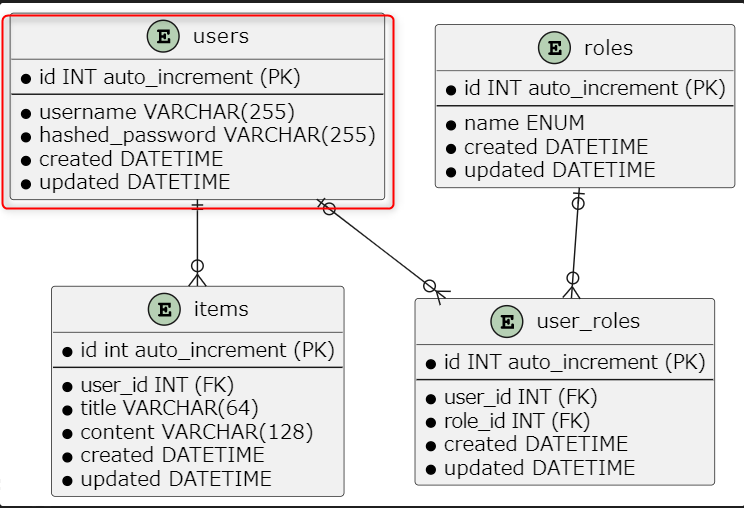
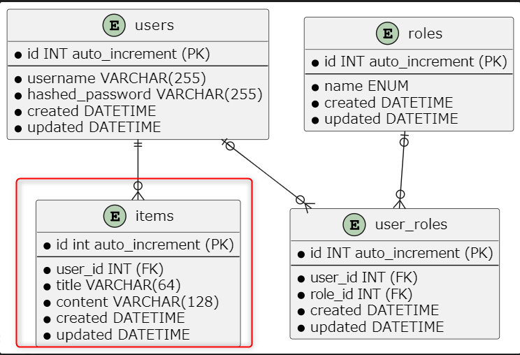

# Note

このドキュメントでは `bin` 配下のコマンド以外は `tutorial/chapter2/src` をルートディレクトリとして解説します。  
chapter2では、最初にMySQLを利用して基本的なデータベースの操作を学びます。  
そのあとに、PythonからSQLAlchemyを利用してデータベースを操作する方法を学びましょう。

# ■ mysqlを起動しましょう

```bash
./bin/mysql.sh
```

# ■ SQLを実行してみましょう

開発コンテナのshellを起動します。

```bash
./bin/run.sh chapter2 --mode shell
```

MySQLにログイン

```bash
MYSQL_PWD=$DB_PASSWORD mysql -u $DB_USER -h $DB_HOST -P $DB_PORT
```

データベースを作成

```sql
-- データベースの新規作成
CREATE DATABASE IF NOT EXISTS chapter2;

-- データベース一覧を表示
SHOW DATABASES;

-- 利用するデータベースを選択
USE chapter2
```


## usersテーブルを作成




- `NOT NULL` : NULL値を許容しない
- `PRIMARY KEY` : 主キーに設定する (主キーとはレコードを一意に特定できる値を持つカラムです)
- `AUTO_INCREMENT` : レコードが追加されるたびに、インクリメントされた値が自動で登録されます。
- `DEFAULT 値` : 登録時に値の指定がない場合にデフォルトで登録される値です。
- `UNIQUE KEY (カラム名)` : ユニークキー制約が設定されたカラムには重複した値が登録できなくなります。

```sql
-- テーブルを作成
CREATE TABLE IF NOT EXISTS `users` (
  `id` int NOT NULL PRIMARY KEY AUTO_INCREMENT,
  `username` varchar(255) NOT NULL,
  `hashed_password` varchar(255) NOT NULL,
  `created` datetime NOT NULL DEFAULT CURRENT_TIMESTAMP,
  `updated` datetime NOT NULL DEFAULT CURRENT_TIMESTAMP ON UPDATE CURRENT_TIMESTAMP,
  UNIQUE KEY (`username`)
);

-- テーブル一覧を表示
SHOW TABLES;

-- テーブル定義を表示
DESC users;
+-----------------+--------------+------+-----+-------------------+-----------------------------------------------+
| Field           | Type         | Null | Key | Default           | Extra                                         |
+-----------------+--------------+------+-----+-------------------+-----------------------------------------------+
| id              | int          | NO   | PRI | NULL              | auto_increment                                |
| username        | varchar(255) | NO   | UNI | NULL              |                                               |
| hashed_password | varchar(255) | NO   |     | NULL              |                                               |
| created         | datetime     | NO   |     | CURRENT_TIMESTAMP | DEFAULT_GENERATED                             |
| updated         | datetime     | NO   |     | CURRENT_TIMESTAMP | DEFAULT_GENERATED on update CURRENT_TIMESTAMP |
+-----------------+--------------+------+-----+-------------------+-----------------------------------------------+
```

データの操作

```sql
-- データの挿入
-- INSERT INTO テーブル名 (カラム名, ...) VALUES (値, ...);
INSERT INTO users (username, hashed_password) VALUES
  ("yamada", "dummy_password"),
  ("sato"  , "dummy_password"),
  ("suzuki", "dummy_password"),
  ("tanaka", "dummy_password"),
  ("dummy" , "dummy_password");

-- データの取得
-- SELECT カラム名, ... FROM テーブル名 WHERE 条件;
SELECT * FROM users;
+----+----------+-----------------+---------------------+---------------------+
| id | username | hashed_password | created             | updated             |
+----+----------+-----------------+---------------------+---------------------+
|  1 | yamada   | dummy_password  | 2023-05-14 14:04:40 | 2023-05-14 14:04:40 |
|  2 | sato     | dummy_password  | 2023-05-14 14:04:40 | 2023-05-14 14:04:40 |
|  3 | suzuki   | dummy_password  | 2023-05-14 14:04:40 | 2023-05-14 14:04:40 |
|  4 | tanaka   | dummy_password  | 2023-05-14 14:04:40 | 2023-05-14 14:04:40 |
|  5 | dummy    | dummy_password  | 2023-05-14 14:04:40 | 2023-05-14 14:04:40 |
+----+----------+-----------------+---------------------+---------------------+

-- 条件を指定してデータを取得
SELECT * FROM users WHERE created <= NOW();
+----+----------+-----------------+---------------------+---------------------+
| id | username | hashed_password | created             | updated             |
+----+----------+-----------------+---------------------+---------------------+
|  1 | yamada   | dummy_password  | 2023-05-14 14:04:40 | 2023-05-14 14:04:40 |
|  2 | sato     | dummy_password  | 2023-05-14 14:04:40 | 2023-05-14 14:04:40 |
|  3 | suzuki   | dummy_password  | 2023-05-14 14:04:40 | 2023-05-14 14:04:40 |
|  4 | tanaka   | dummy_password  | 2023-05-14 14:04:40 | 2023-05-14 14:04:40 |
|  5 | dummy    | dummy_password  | 2023-05-14 14:04:40 | 2023-05-14 14:04:40 |
+----+----------+-----------------+---------------------+---------------------+

-- 件数を指定してデータを取得
-- ORDER BY カラム名 [ASC|DESC] : カラム名をASC(昇順)もしくはDESC(降順)で整列
-- LIMIT 数値 : 取得する最大件数を指定
SELECT id, username FROM users ORDER BY id ASC LIMIT 1;
+----+----------+
| id | username |
+----+----------+
|  1 | yamada   |
+----+----------+

-- データの変更
-- UPDATE テーブル名 SET カラム名=値, ... WHERE 条件;
UPDATE users SET username='midorikawa' WHERE username='sato';

-- データの削除
-- DELETE FROM テーブル名 WHERE 条件;
DELETE FROM users WHERE username="dummy";

-- 結果
SELECT * FROM users;
+----+------------+-----------------+---------------------+---------------------+
| id | username   | hashed_password | created             | updated             |
+----+------------+-----------------+---------------------+---------------------+
|  1 | yamada     | dummy_password  | 2023-05-14 14:04:40 | 2023-05-14 14:04:40 |
|  2 | midorikawa | dummy_password  | 2023-05-14 14:04:40 | 2023-05-14 14:05:35 |
|  3 | suzuki     | dummy_password  | 2023-05-14 14:04:40 | 2023-05-14 14:04:40 |
|  4 | tanaka     | dummy_password  | 2023-05-14 14:04:40 | 2023-05-14 14:04:40 |
+----+------------+-----------------+---------------------+---------------------+
```

## 1対多のリレーション

`users` テーブルに紐づく `items` テーブルを作成してみましょう。  
1対多のリレーションでは子テーブル( `items` )に親テーブル( `user` ) の `id` と紐づくカラム `user_id` を外部キーとして定義します。  



- `KEY インデックス名 (カラム名)` : 指定されたカラムにインデックスを設定します。 `KEY` は `INDEX` と指定してもOKです。  
※ インデックスとは: データを木構造で保持することで、高速に検索できるようにする設定です。
- `FOREIGN KEY インデックス名 (カラム名) REFERENCES 親テーブル (カラム名)` : 外部キーを設定します。 「カラム名」が「親テーブル.カラム名」に紐づくことを意味します。


```sql
-- usersに紐づくitemsテーブルを追加
CREATE TABLE IF NOT EXISTS `items` (
  `id` int NOT NULL PRIMARY KEY AUTO_INCREMENT,
  `user_id` int NOT NULL,
  `title` varchar(64) NOT NULL,
  `content` varchar(128) NOT NULL,
  `created` datetime NOT NULL DEFAULT CURRENT_TIMESTAMP,
  `updated` datetime NOT NULL DEFAULT CURRENT_TIMESTAMP ON UPDATE CURRENT_TIMESTAMP,
  KEY `user_id` (`user_id`),
  FOREIGN KEY fk_user (`user_id`) REFERENCES users (`id`)
);

-- itemsを追加
INSERT INTO items (user_id, title, content) VALUES
  (1, "a", "foo" ),
  (2, "b", "bar" ),
  (1, "c", "baz" ),
  (3, "d", "hoge"),
  (2, "e", "fuga");

-- 登録されたITEMS
SELECT * FROM items;
+----+---------+-------+---------+---------------------+---------------------+
| id | user_id | title | content | created             | updated             |
+----+---------+-------+---------+---------------------+---------------------+
|  1 |       1 | a     | foo     | 2023-05-14 14:07:13 | 2023-05-14 14:07:13 |
|  2 |       2 | b     | bar     | 2023-05-14 14:07:13 | 2023-05-14 14:07:13 |
|  3 |       1 | c     | baz     | 2023-05-14 14:07:13 | 2023-05-14 14:07:13 |
|  4 |       3 | d     | hoge    | 2023-05-14 14:07:13 | 2023-05-14 14:07:13 |
|  5 |       2 | e     | fuga    | 2023-05-14 14:07:13 | 2023-05-14 14:07:13 |
+----+---------+-------+---------+---------------------+---------------------+
```

内部結合

`users` テーブルの `id` カラム と `items` テーブルの `user_id` カラム が一致するレコードを連結します。  
内部結合では指定したカラムの値が一致するレコードのみを抽出します。相手方に一致するレコードが存在しない場合は抽出されません。  

```sql
-- INNER JOIN: itemsが存在するユーザーとそのアイテムを抽出する (AND結合)
SELECT users.id, users.username, items.title, items.content FROM users INNER JOIN items ON users.id = items.user_id;
+----+------------+-------+---------+
| id | username   | title | content |
+----+------------+-------+---------+
|  2 | midorikawa | b     | bar     |
|  2 | midorikawa | e     | fuga    |
|  3 | suzuki     | d     | hoge    |
|  1 | yamada     | a     | foo     |
|  1 | yamada     | c     | baz     |
+----+------------+-------+---------+
```

外部結合

`users` テーブルの `id` カラム と `items` テーブルの `user_id` カラム が一致するレコードを連結します。  
内部結合と異なる点は相手方に一致するレコードが存在しないレコードも抽出されることです。  
今回の例では `LEFT OUTER JOIN` を利用しているため、 左側のテーブル( `users` )のレコードは全件抽出され、右側のテーブル( `items` )のレコードは一致するもののみが抽出されます。  
`RIGHT OUTER JOIN` は右側のテーブルのレコードが全件抽出されます。


```sql
-- OUTER JOIN: 全ユーザーとそのアイテムを抽出する (OR結合)
SELECT users.id, users.username, items.title, items.content FROM users LEFT OUTER JOIN items ON users.id = items.user_id;
+----+------------+-------+---------+
| id | username   | title | content |
+----+------------+-------+---------+
|  2 | midorikawa | b     | bar     |
|  2 | midorikawa | e     | fuga    |
|  3 | suzuki     | d     | hoge    |
|  4 | tanaka     | NULL  | NULL    |
|  1 | yamada     | a     | foo     |
|  1 | yamada     | c     | baz     |
+----+------------+-------+---------+
```

## 多対多のリレーション

`users` テーブルに多対多で紐づく `roles` テーブルを作成してみましょう。  
一対多のリレーションとは異なり、 `roles` には `users.id` と紐づくカラムが存在しないことに注目してください。  
多対多のリレーションでは、中間テーブルを利用して2つのテーブルを関連付けるため、相手のテーブルを関連付けるためのカラムを持ちません。


```sql
-- rolesテーブルの作成
CREATE TABLE IF NOT EXISTS `roles` (
  `id` int NOT NULL PRIMARY KEY AUTO_INCREMENT,
  `name` enum('SYSTEM_ADMIN','LOCATION_ADMIN','LOCATION_OPERATOR') NOT NULL,
  `created` datetime NOT NULL DEFAULT CURRENT_TIMESTAMP,
  `updated` datetime NOT NULL DEFAULT CURRENT_TIMESTAMP ON UPDATE CURRENT_TIMESTAMP,
  UNIQUE KEY `ix_roles_name` (`name`)
);

-- データ登録
INSERT INTO roles (name) VALUES ("SYSTEM_ADMIN"), ("LOCATION_ADMIN"), ("LOCATION_OPERATOR");

-- 結果
SELECT * FROM roles;
+----+-------------------+---------------------+---------------------+
| id | name              | created             | updated             |
+----+-------------------+---------------------+---------------------+
|  1 | SYSTEM_ADMIN      | 2023-05-14 08:47:47 | 2023-05-14 08:47:47 |
|  2 | LOCATION_ADMIN    | 2023-05-14 08:47:47 | 2023-05-14 08:47:47 |
|  3 | LOCATION_OPERATOR | 2023-05-14 08:47:47 | 2023-05-14 08:47:47 |
+----+-------------------+---------------------+---------------------+

```

多対多でテーブルを関連付けるには中間テーブルが必要になります。  
`users` テーブルと `roles` テーブル を関連付ける `user_roles` テーブルを作成してみましょう。  
中間テーブル( `user_roles` )は `users.id` に紐づく `user_id` カラム, `roles.id` に紐づく `role_id` カラムを持ちます。

```sql
CREATE TABLE IF NOT EXISTS `user_roles` (
  `id` int NOT NULL PRIMARY KEY AUTO_INCREMENT,
  `user_id` int NOT NULL,
  `role_id` int NOT NULL,
  `created` datetime NOT NULL DEFAULT CURRENT_TIMESTAMP,
  `updated` datetime NOT NULL DEFAULT CURRENT_TIMESTAMP ON UPDATE CURRENT_TIMESTAMP,
  UNIQUE KEY `unique_idx_userid_roleid` (`user_id`,`role_id`),
  KEY `user_id` (`user_id`),
  KEY `role_id` (`role_id`),
  CONSTRAINT `user_roles_ibfk_1` FOREIGN KEY (`role_id`) REFERENCES `roles` (`id`),
  CONSTRAINT `user_roles_ibfk_2` FOREIGN KEY (`user_id`) REFERENCES `users` (`id`)
);

-- ユーザーにロールをアサイン
INSERT INTO user_roles (user_id, role_id) VALUES (1, 1), (1, 2), (1, 3), (2, 2), (3, 3);

-- 結果
SELECT * FROM user_roles;
+----+---------+---------+---------------------+---------------------+
| id | user_id | role_id | created             | updated             |
+----+---------+---------+---------------------+---------------------+
|  1 |       1 |       1 | 2023-05-14 09:19:58 | 2023-05-14 09:19:58 |
|  2 |       1 |       2 | 2023-05-14 09:19:58 | 2023-05-14 09:19:58 |
|  3 |       1 |       3 | 2023-05-14 09:19:58 | 2023-05-14 09:19:58 |
|  4 |       2 |       2 | 2023-05-14 09:19:58 | 2023-05-14 09:19:58 |
|  5 |       3 |       3 | 2023-05-14 09:19:58 | 2023-05-14 09:19:58 |
+----+---------+---------+---------------------+---------------------+
```

内部結合

`users`, `user_roles`, `roles` を内部結合してみましょう。  
`users.id = user_roles.user_id` と `user_roles.role_id = roles.id` の条件で紐づけを行います。

```sql
-- 内部結合なので、紐づくroleが存在しない tanaka(id=4) は抽出されません。
SELECT
  users.id as user_id,
  users.username as user_name,
  roles.name as role_name
FROM users
  INNER JOIN user_roles ON user_roles.user_id = users.id
  INNER JOIN roles ON roles.id = user_roles.role_id;

+---------+------------+-------------------+
| user_id | user_name  | role_name         |
+---------+------------+-------------------+
|       1 | yamada     | SYSTEM_ADMIN      |
|       1 | yamada     | LOCATION_ADMIN    |
|       2 | midorikawa | LOCATION_ADMIN    |
|       1 | yamada     | LOCATION_OPERATOR |
|       3 | suzuki     | LOCATION_OPERATOR |
+---------+------------+-------------------+

-- users.id でグルーピングして抽出
SELECT
  users.id as user_id,
  users.username as user_name,
  GROUP_CONCAT(roles.name) as role_name
FROM users
  INNER JOIN user_roles ON user_roles.user_id = users.id
  INNER JOIN roles ON roles.id = user_roles.role_id
GROUP BY users.id;

+---------+------------+-----------------------------------------------+
| user_id | user_name  | role_name                                     |
+---------+------------+-----------------------------------------------+
|       1 | yamada     | SYSTEM_ADMIN,LOCATION_ADMIN,LOCATION_OPERATOR |
|       2 | midorikawa | LOCATION_ADMIN                                |
|       3 | suzuki     | LOCATION_OPERATOR                             |
+---------+------------+-----------------------------------------------+
```

外部結合

`users`, `user_roles`, `roles` を内部結合してみましょう。  
`users.id = user_roles.user_id` と `user_roles.role_id = roles.id` の条件で紐づけを行います。

```sql
-- 外部結合なので、紐づくroleが存在しない tanaka(id=4) も抽出されます。
SELECT
  users.id as user_id,
  users.username as user_name,
  roles.name as role_name
FROM users
  LEFT OUTER JOIN user_roles ON user_roles.user_id = users.id
  LEFT OUTER JOIN roles ON roles.id = user_roles.role_id;
+---------+------------+-------------------+
| user_id | user_name  | role_name         |
+---------+------------+-------------------+
|       2 | midorikawa | LOCATION_ADMIN    |
|       3 | suzuki     | LOCATION_OPERATOR |
|       4 | tanaka     | NULL              |
|       1 | yamada     | SYSTEM_ADMIN      |
|       1 | yamada     | LOCATION_ADMIN    |
|       1 | yamada     | LOCATION_OPERATOR |
+---------+------------+-------------------+

-- users.id でグルーピングして抽出
SELECT
  users.id as user_id,
  users.username as user_name,
  GROUP_CONCAT(roles.name) as role_name
FROM users
  LEFT OUTER JOIN user_roles ON user_roles.user_id = users.id
  LEFT OUTER JOIN roles ON roles.id = user_roles.role_id
GROUP BY users.id;
+---------+------------+-----------------------------------------------+
| user_id | user_name  | role_name                                     |
+---------+------------+-----------------------------------------------+
|       1 | yamada     | SYSTEM_ADMIN,LOCATION_ADMIN,LOCATION_OPERATOR |
|       2 | midorikawa | LOCATION_ADMIN                                |
|       3 | suzuki     | LOCATION_OPERATOR                             |
|       4 | tanaka     | NULL                                          |
+---------+------------+-----------------------------------------------+
```


## テーブル・データベースの削除

```sql
-- テーブルの中身をすべて削除する
TRUNCATE TABLE items;
TRUNCATE TABLE user_roles;

-- テーブルを削除する
DROP TABLE items;
DROP TABLE user_roles;
DROP TABLE roles;
DROP TABLE users;

-- データベースを削除する
DROP DATABASE chapter2;

-- MySQLからログアウト
exit;
```

```bash
# 開発用shellからログアウト
exit
```

# ■ Pythonからデータベースを触ってみる (SQLAlchemy)

[SQLAlchemy](https://www.sqlalchemy.org/)

## データベースの作成

```bash
# 開発用shellを起動
./bin/run.sh chapter2 --mode shell

# データベースを作成
MYSQL_PWD=$DB_PASSWORD mysql -u $DB_USER -h $DB_HOST -P $DB_PORT -e "DROP DATABASE IF EXISTS chapter2"
MYSQL_PWD=$DB_PASSWORD mysql -u $DB_USER -h $DB_HOST -P $DB_PORT -e "CREATE DATABASE IF NOT EXISTS chapter2"

# 開発用shellからログアウト
exit
```

## JupyterLab起動

```bash
./bin/run.sh chapter2 --mode jupyter
```

jupyter起動時に表示されるURL( http://localhost:8889/lab?token=41e856b7be74ca12e156c8f711e2bf4dd6ff88ddb14cb629 )にブラウザでアクセスしてください。

`tutorial/chapter2/sample/sqlalchemy_tutorial.ipynb` の実装を参考に、SQLAlchemyを利用してPythonからデータベースを操作してみましょう。